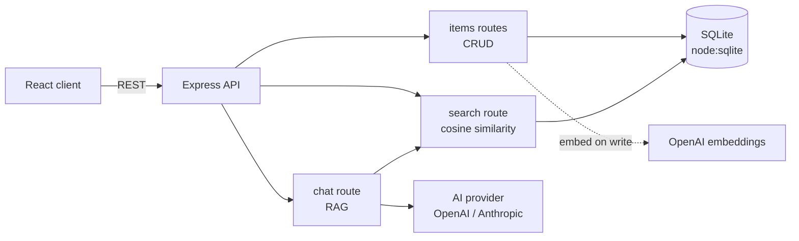

# Smart Notes Hub

A full-stack notes & task manager with retrieval-augmented (RAG) semantic
search and an AI chat assistant that can answer questions using your own
notes as context. Built end-to-end (architecture, implementation, deployment,
docs) as a single solo project.

**Live demo:** [smart-notes-hub-651554012781.us-central1.run.app](https://smart-notes-hub-651554012781.us-central1.run.app) — deployed on Google Cloud Run

## Why this project

Built as a single, cohesive demonstration of full-stack + cloud + AI skills:

| Requirement | Where it lives |
|---|---|
| React + TypeScript frontend | [`client/`](client) — Vite + React 18 + TS |
| Backend API (Node.js) | [`server/`](server) — Express + TypeScript |
| GCP deployment | [`Dockerfile`](Dockerfile) — single-container deploy to Cloud Run |
| System design / architecture | Layered routes → services → data (see below) |
| Git & documentation culture | This README, [ADRs](#architecture-decisions), [`.github/workflows/ci.yml`](.github/workflows/ci.yml) |
| LLM APIs (OpenAI & Anthropic) | [`server/src/services/aiProvider.ts`](server/src/services/aiProvider.ts) — swappable provider |
| Vector database / embeddings | [`server/src/services/embeddings.ts`](server/src/services/embeddings.ts) + [`server/src/routes/search.ts`](server/src/routes/search.ts) |
| GCE (VMs) / VPC networking | [`infra/gce-watchdog-startup.sh`](infra/gce-watchdog-startup.sh) — custom VPC + GCE VM watchdog, see below |

## Architecture



- Every note/task is embedded (OpenAI `text-embedding-3-small`) on write and
  the vector is stored alongside the row in SQLite.
- `/api/search` embeds the query and ranks stored items by cosine similarity
  — a minimal, dependency-free vector search suitable for a single-user app.
- `/api/chat` runs the same retrieval step, stuffs the top matches into the
  system prompt, and asks the configured LLM provider to answer with
  citations — a small, from-scratch RAG pipeline.

### GCE + VPC watchdog

A small `e2-micro` GCE VM (`smart-notes-hub-watchdog`) runs in its own custom
VPC (`smart-notes-hub-vpc` / `smart-notes-hub-subnet`, `10.10.0.0/24`) and
polls the Cloud Run app's `/health` endpoint every 15 minutes via a systemd
timer, logging uptime results locally on the VM. Provisioned with:

- Custom-mode VPC + dedicated subnet (not the default network)
- Firewall rule restricting SSH to Google's IAP range (`35.235.240.0/20`)
  only — no SSH port exposed to the public internet
- VM created with `--no-service-account --no-scopes` (least privilege —
  the watchdog only needs outbound HTTPS, not GCP API access)
- Access via `gcloud compute ssh --tunnel-through-iap` (IAP TCP forwarding,
  no static SSH keys/bastion host)

See [`infra/gce-watchdog-startup.sh`](infra/gce-watchdog-startup.sh) for the
full startup script and provisioning commands below.

## Architecture decisions

- **`node:sqlite` over a hosted DB** — zero extra infrastructure/cost for a
  single-user demo, same pattern proven in the `gcp-cloudrun-demo` project.
- **In-app cosine similarity over a hosted vector DB (Chroma/Pinecone)** —
  at demo scale (dozens–hundreds of items) a full vector database is
  unnecessary; the interface is isolated in `search.ts` so swapping in a
  real vector store later is a contained change.
- **Provider abstraction for chat (`aiProvider.ts`)** — lets the LLM backend
  switch between OpenAI and Anthropic via one env var, without touching the
  RAG pipeline. Embeddings always use OpenAI since Anthropic has no
  embeddings endpoint.
- **Single Cloud Run service** — the server serves the built client's static
  files directly, so one container/one deploy covers the whole app.
- **`/health` instead of `/healthz`** — Cloud Run's edge intercepts
  `/healthz` and returns Google's own 404 before it reaches the container.
- **Custom VPC + IAP-only SSH for the watchdog VM** — avoids exposing port
  22 to `0.0.0.0/0`; IAP tunneling authenticates via IAM instead of a
  standing bastion host or public SSH keys.

## API

| Method | Path | Description |
|---|---|---|
| GET | `/health` | Health check |
| GET | `/api/items` | List all notes/tasks |
| POST | `/api/items` | Create a note/task `{ type, title, content, status? }` |
| PUT | `/api/items/:id` | Update a note/task |
| DELETE | `/api/items/:id` | Delete a note/task |
| POST | `/api/search` | Semantic search `{ query, k? }` |
| POST | `/api/chat` | RAG chat `{ message }` → `{ answer, sources }` |

## Local development

```bash
npm install
cp server/.env.example server/.env   # add OPENAI_API_KEY (and ANTHROPIC_API_KEY if used)
npm run dev:server                   # http://localhost:8080
npm run dev:client                   # http://localhost:5173 (proxies /api to :8080)
```

## Deployment

Deployed to Google Cloud Run as a single container:

```bash
gcloud run deploy smart-notes-hub \
  --source . \
  --region us-central1 \
  --allow-unauthenticated \
  --set-env-vars AI_CHAT_PROVIDER=openai \
  --set-secrets OPENAI_API_KEY=OPENAI_API_KEY:latest
```

Note: `data.db` lives at `/tmp` inside the container, so data resets on
cold start/instance recycling — acceptable for a demo, not for production
(would move to Cloud SQL or a persisted volume for that).

### GCE + VPC watchdog setup

```bash
gcloud compute networks create smart-notes-hub-vpc --subnet-mode=custom
gcloud compute networks subnets create smart-notes-hub-subnet \
  --network=smart-notes-hub-vpc --region=us-central1 --range=10.10.0.0/24
gcloud compute firewall-rules create allow-iap-ssh \
  --network=smart-notes-hub-vpc --direction=INGRESS --action=ALLOW \
  --rules=tcp:22 --source-ranges=35.235.240.0/20
gcloud compute instances create smart-notes-hub-watchdog \
  --zone=us-central1-a --machine-type=e2-micro \
  --network=smart-notes-hub-vpc --subnet=smart-notes-hub-subnet \
  --image-family=debian-12 --image-project=debian-cloud \
  --no-service-account --no-scopes \
  --metadata-from-file=startup-script=infra/gce-watchdog-startup.sh
```

## Tech stack

`React` · `TypeScript` · `Vite` · `Node.js` · `Express` · `node:sqlite` ·
`OpenAI API` · `Anthropic API` · `Docker` · `Google Cloud Run` · `Compute Engine` ·
`VPC` · `IAP` · `GitHub Actions`
